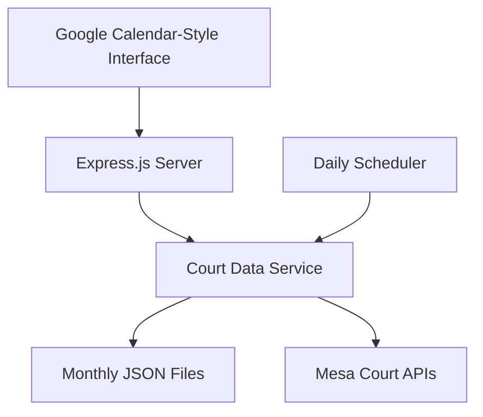

# Design Document

## Overview

The Court Aggregator is a cross-platform Node.js application that consolidates court availability from multiple reservation systems into a unified Google Calendar-style web interface. The system provides monthly, weekly, and daily calendar views, each showing booking time blocks for park locations (like "Kleinman Park", "Gene Autry", etc.) with increasing levels of detail.

The application runs as a lightweight web server optimized for Unix/Linux systems including Raspberry Pi deployment, with daily data updates at 5PM PST. The interface features view toggle buttons allowing users to switch between calendar perspectives, with visual time blocks representing when courts are booked, making it easy to spot available periods at different granularities. The system defaults to displaying current day availability when first loaded, providing immediate value to users seeking today's court options.

## Architecture

### System Architecture



### Technology Stack

- **Backend**: Node.js with Express.js
- **Storage**: JSON files for monthly data (Pi-friendly, no DB overhead)
- **Frontend**: HTML/CSS/JavaScript with calendar grid layout
- **Scheduling**: node-cron for daily 5PM PST updates
- **Process Management**: PM2 for Pi service management
- **HTTP Client**: axios for API requests

### Cross-Platform Compatibility

**Operating System Support**:
- Primary target: Unix/Linux systems (Ubuntu, Debian, Raspberry Pi OS)
- Cross-platform Node.js ensures compatibility across different Unix variants
- File path handling uses Node.js path module for OS-agnostic operations
- Process management adapts to available system tools (PM2, systemd, etc.)

**Deployment Flexibility**:
- Containerization support for Docker deployment
- Environment variable configuration for different deployment contexts
- Graceful handling of OS-specific features and limitations

### Data Flow

1. **Daily Update**: node-cron scheduler triggers at 5PM PST
2. **Enhanced Processing**: 
   - Extract park names from court resources
   - Analyze time slots to determine booking periods
   - Count total/booked/available courts per park
   - Generate human-readable booking details
3. **Document Storage**: Update today's data in monthly JSON file
4. **Calendar Display**: Serve monthly data in calendar grid format

### Raspberry Pi Deployment

**Process Management**:
- Use PM2 to keep the Node.js app running as a service
- PM2 handles auto-restart on crashes and system reboots
- Built-in node-cron handles the 5PM PST scheduling

**System Requirements**:
- Node.js (lightweight for Pi)
- Minimal memory footprint with JSON file storage
- No external database dependencies

## Components and Interfaces

### 1. Court Data Service

**Purpose**: Fetches and processes court data from multiple reservation systems with backfill capabilities

**Key Methods**:
- `fetchCourtData(date, facilityGroupId, endpoint)`: Gets data from configured API endpoints for specific date and facility
- `processResponse(data)`: Extracts park names and detailed availability
- `analyzeTimeSlots(court)`: Finds booked time periods for each court
- `aggregateByPark(courts)`: Groups courts by park and calculates totals
- `generateTimeWindows(park)`: Creates structured time window data with court details
- `scheduleDaily()`: Sets up node-cron job for 5PM PST updates
- `runBackfillJob()`: Preloads data from today to two weeks ahead on startup
- `getParkList()`: Returns list of all available parks for filter sidebar with PDF links
- `handleMultipleEndpoints()`: Manages concurrent requests to multiple API endpoints
- `validateEndpointResponse(data, endpoint)`: Ensures response format consistency across endpoints

**Backfill Job Configuration**:
```javascript
// Run on startup to preload 2 weeks of data
async function runBackfillJob() {
  const facilityGroups = [29, 33, 35]; // Kleinman, Gene Autry, Monterey
  const startDate = new Date();
  const endDate = new Date(Date.now() + 14 * 24 * 60 * 60 * 1000);
  
  for (let date = startDate; date <= endDate; date.setDate(date.getDate() + 1)) {
    for (const facilityId of facilityGroups) {
      await fetchCourtData(date.toISOString().split('T')[0], facilityId);
    }
  }
}
```

**Cron Configuration**:
```javascript
// Run daily at 5PM PST (adjust for daylight saving)
cron.schedule('0 17 * * *', fetchAndUpdateData, {
  timezone: "America/Los_Angeles"
});
```

### 2. Monthly Document Cache

**File Structure**:
```
data/
  2025-01.json  // January 2025 data
  2025-02.json  // February 2025 data
```

**Document Format**:
```javascript
{
  "month": "2025-01",
  "lastUpdated": "2025-01-08T17:00:00Z",
  "parkList": [
    { 
      "name": "Kleinman Park", 
      "color": "#4285f4",
      "pdfLink": "https://www.mesaaz.gov/files/assets/public/v/237/activities-culture/prcf/facilities/pickleball-public-court-calendars/kleinman-pickleball-court.pdf"
    },
    { 
      "name": "Gene Autry Park", 
      "color": "#34a853",
      "pdfLink": null
    },
    { 
      "name": "Monterey Park", 
      "color": "#ea4335",
      "pdfLink": "https://www.mesaaz.gov/files/assets/public/v/244/activities-culture/prcf/facilities/pickleball-public-court-calendars/brady-pickleball-court.pdf"
    }
  ],
  "days": {
    "2025-01-08": {
      "parks": [
        {
          "name": "Kleinman Park",
          "totalCourts": 4,
          "bookedCourts": 3,
          "availableCourts": 1,
          "status": "partial",
          "color": "#4285f4",
          "timeWindows": [
            {
              "startTime": "14:30",
              "endTime": "17:00",
              "courts": ["Court 01", "Court 01A", "Court 01B"],
              "displayTime": "2:30-5:00 PM"
            },
            {
              "startTime": "18:00",
              "endTime": "20:00",
              "courts": ["Court 09A"],
              "displayTime": "6:00-8:00 PM"
            }
          ]
        }
      ]
    }
  }
}
```

### 3. Calendar Web Interface

**Google Calendar-Style Design**:
- Multi-view calendar interface (Monthly, Weekly, Daily) with time blocking visualization
- Each view shows court booking blocks for different parks with appropriate detail level
- Color-coded time blocks representing booked periods
- Clean, minimal design following Google Calendar patterns
- Responsive layout that works on desktop and mobile

**View Toggle System**:
- **View Buttons**: Prominent toggle buttons for Monthly, Weekly, Daily views
- **State Persistence**: Remember selected view when navigating between dates
- **Context Preservation**: Maintain current date and park filter selections across view changes
- **Smooth Transitions**: Animated transitions between different view layouts

**Monthly View Features**:
- **Calendar Grid**: Traditional 7x6 calendar layout with day cells
- **Time Blocks**: Compact visual bars within each day showing booked periods
- **Overview Focus**: Shows general availability patterns across the month
- **Navigation**: Previous/next month buttons

**Weekly View Features**:
- **7-Day Grid**: Horizontal week layout with detailed time slots
- **Enhanced Detail**: More granular time information than monthly view
- **Time Axis**: Vertical time axis showing hourly increments
- **Court Details**: Individual court availability within each time slot
- **Navigation**: Previous/next week buttons

**Daily View Features**:
- **Single Day Focus**: Full day view with maximum detail
- **Hourly Breakdown**: Detailed hourly time slots (9 AM - 10 PM)
- **Court-by-Court**: Individual court status for each time period
- **Booking Details**: Complete booking information and availability
- **Navigation**: Previous/next day buttons

**Universal Features (All Views)**:
- **Park Filtering**: Sidebar with checkboxes to show/hide specific parks
- **Color Coding**: Consistent park colors across all views
- **Hover Details**: Tooltips showing specific court and time information
- **Loading States**: Visual feedback during data fetching
- **Error Handling**: Graceful fallback when data is unavailable
- **Default Display**: Shows current day availability when application first loads
- **Interactive Details**: Click on day cells for expanded park information

**Park Filter Sidebar**:
- Checkbox list of all available parks
- Color indicator next to each park name
- "Select All" / "Deselect All" options
- Real-time filtering as checkboxes are toggled
- Collapsible sidebar for mobile devices
- Consistent across all calendar views

**Responsive Design Considerations**:
- **Mobile Monthly**: Stack weeks vertically, smaller day cells
- **Mobile Weekly**: Horizontal scroll for week view, touch-friendly navigation
- **Mobile Daily**: Full-width time slots, vertical scrolling
- **Touch Interactions**: Appropriate touch targets for all interactive elements
- **Adaptive Layout**: Interface adapts to screen size while maintaining usability

## Data Models

### Park Model
```javascript
{
  name: string, // "Kleinman Park", "Gene Autry Park"
  totalCourts: number,
  bookedCourts: number,
  availableCourts: number,
  status: 'available' | 'partial' | 'booked',
  color: string, // "#4285f4"
  timeWindows: [
    {
      startTime: string, // "14:30" (24-hour format)
      endTime: string, // "17:00" (24-hour format)
      courts: string[], // ["Court 01", "Court 01A", "Court 01B"]
      displayTime: string // "2:30-5:00 PM" (human-readable)
    }
  ]
}
```

### Time Window Model
```javascript
{
  startTime: string, // "14:30" - 24-hour format for easy sorting/comparison
  endTime: string, // "17:00" - 24-hour format for easy sorting/comparison
  courts: string[], // ["Court 01", "Court 01A"] - specific courts booked
  displayTime: string // "2:30-5:00 PM" - human-readable format for UI
}
```

### Time Display Strategy
**Internal Representation**: The system maintains 30-minute time slot granularity internally (9:00 AM, 9:30 AM, 10:00 AM, 10:30 AM, etc.) to accurately track court bookings and availability.

**UI Display**: The user interface displays time windows on an hourly basis (9:00 AM, 10:00 AM, 11:00 AM, etc.) for better readability and reduced visual clutter, while still representing the underlying 30-minute booking periods accurately.

**Time Range**: Court availability is displayed from 9:00 AM to 10:00 PM, providing coverage for typical court operating hours.

### Enhanced Processing Logic
1. **Extract park name** from court resource names using hard-coded mapping (e.g., "Pickleball Court 01" → "Kleinman Park")
2. **Count total courts** per park
3. **Analyze time slots** for each court:
   - Find continuous booked periods (status 0)
   - Identify which courts are booked and for how long
4. **Calculate availability**:
   - `totalCourts` = count of all courts at park
   - `bookedCourts` = courts with any booked time slots
   - `availableCourts` = courts with all available time slots (status 1)
5. **Determine status**:
   - `available` = all courts available
   - `booked` = all courts fully booked
   - `partial` = some courts available, some booked
6. **Generate time windows**: Create structured time window objects with court details and display formatting

## Error Handling

### Comprehensive Error Management

**API Endpoint Failures**:
- **Single Endpoint Down**: Continue processing other endpoints, log failure, display partial data with indicators
- **Multiple Endpoints Down**: Fall back to cached data with "last updated" timestamp
- **All Endpoints Down**: Display cached data with clear messaging about staleness
- **Network Connectivity Issues**: Graceful degradation with cached data, automatic retry logic

**Data Processing Errors**:
- **Invalid Response Format**: Log error details, attempt data recovery, use previous cache
- **Partial Data Corruption**: Display available data, mark problematic sections clearly
- **Cache File Issues**: Attempt fresh API fetch, display without caching if successful

**User Experience During Errors**:
- **Loading States**: Clear visual feedback during data fetching attempts
- **Error Messages**: User-friendly messages with suggested actions
- **Partial Data Display**: Show what's available, indicate missing or stale data
- **Timestamp Visibility**: Always show when data was last successfully updated

### Simple Error Scenarios

1. **API Failure**: Show cached data with "Last updated" timestamp
2. **No Cached Data**: Display "Data temporarily unavailable" message in calendar cells
3. **Invalid Response**: Log error and use previous cache

### Edge Cases & Considerations

**Park Name Extraction**:
- Use hard-coded mapping of court resource names to park names
- Park names are stable (updated less than once per decade)
- Simple string matching or contains logic for court-to-park mapping

**Color Consistency**:
- Generate consistent colors using hash of park name
- Store color assignments in monthly JSON files
- Ensure sufficient color contrast for accessibility

**Time Zone Handling**:
- Use "America/Los_Angeles" timezone for cron scheduling
- Handle daylight saving time transitions automatically
- Display all times in PST/PDT for user consistency

**Calendar Navigation**:
- Show empty calendar cells for months with no data
- Disable navigation to future months beyond current + 1
- Provide clear messaging when no data is available

**Mobile Responsiveness**:
- Stack time blocks vertically on small screens
- Make filter sidebar collapsible/overlay on mobile
- Ensure touch targets are appropriately sized

**View State Management**:
- Store current view type in browser localStorage
- Maintain date context when switching between views
- Preserve park filter selections across view changes
- Handle URL routing for direct links to specific views/dates

### User Experience
- Clear status indicators in calendar cells
- Last updated timestamp always visible
- Simple error messages when data is unavailable
- Graceful degradation when some days have missing data

## Testing Strategy

### Basic Testing Approach

**Unit Testing**:
- Test API data fetching with mock responses
- Test park name extraction from court names
- Test availability status calculation
- Test JSON file cache operations
- Test calendar date calculations

**Integration Testing**:
- Test full data flow from API to calendar display
- Test scheduled updates
- Test error handling with API failures
- Test calendar navigation and view switching
- Test view state persistence across navigation

**Manual Testing**:
- Verify all three calendar views display correctly
- Test view toggle functionality and smooth transitions
- Test responsive design on mobile devices for all views
- Test park filtering across different views
- Validate color coding and visual indicators consistency
- Test navigation within each view type (month/week/day)